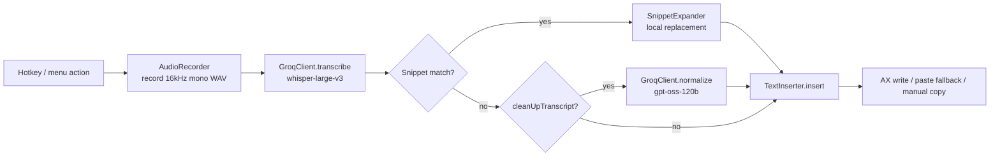

# Repository Guidelines

## Project Overview

T-Whisper is a native macOS menu-bar dictation app. It records microphone
audio, transcribes it via Groq's `whisper-large-v3`, optionally normalizes
the transcript with Groq's `openai/gpt-oss-120b`, expands matched voice
snippets locally, and inserts the final text into whatever app was focused
before recording started — via the Accessibility API with a clipboard/paste
fallback. Recording is triggered by a global hotkey (Fn key or a custom
key combo) in either toggle or hold-to-talk mode.

## Architecture & Data Flow

`AppModel` (`Sources/TWhisperKit/AppModel.swift`) is the single
`@MainActor @ObservableObject` orchestrator. It depends only on protocols
defined in `Protocols.swift`, never on concrete types directly:

- `AudioCapturing` → `AudioRecorder`
- `DictationTranscribing` → `GroqClient`
- `TextInserting` → `TextInserter`
- `HotkeyRegistering` → `HotkeyController`
- `RecordingHUDPresenting` → `RecordingPanel`
- `APIKeyStoring` → `SystemKeychainStore` (wraps `KeychainStore`)

This protocol seam is the app's only dependency-injection mechanism —
production code wires the real types in `TWhisperApp.swift`; tests wire
fakes (`Tests/TWhisperTests/Fakes.swift`).

Pipeline, driven by `AppModel`:



Every recording session is tagged with a `currentSessionID` (UUID) in
`AppModel`. Async callbacks (transcription, normalization) check this ID
before mutating state or inserting text, so a cancelled/stale session can
never clobber a newer one — this is the core race-condition guard in the
codebase; preserve it when touching the pipeline.

`TextInserter` captures the destination (`InsertionTarget`: PID + focused
`AXUIElement` + selection range) **before** recording starts, so the menu
bar / recording HUD stealing focus doesn't break insertion. On insert it
re-verifies the target is unchanged (same PID, `CFEqual` element, same
selection, editable/enabled/settable) before writing via AX; otherwise it
refuses AX and falls back to synthesized ⌘V paste, or `manualCopyRequired`
if paste isn't safe either.

Two independent hotkey backends, coordinated by `HotkeyController`:
- `HotkeyManager` — Carbon `RegisterEventHotKey` for custom key combos and
  the fixed ⌘⌃C / ⌘⌃V / Escape bindings.
- `FnKeyMonitor` — a listen-only `CGEventTap` for solo Fn-key presses
  (chord presses are explicitly ignored).

SwiftUI views (`MenuBarView.swift`, `SettingsView.swift`,
`ShortcutRecorderView.swift`) bind directly to `AppModel`'s `@Published`
properties (`@ObservedObject`) — there is no separate view-model layer.
`RecordingPanel` is the one non-SwiftUI-native piece: a borderless,
non-activating `NSPanel` hosting a SwiftUI view via `NSHostingView`.

## Key Directories

- `Sources/TWhisperKit/` — all business logic and SwiftUI views (the
  library target; UI files live here too, not in the app target).
- `Sources/TWhisperApp/` — `TWhisperApp.swift` only: `@main App` struct,
  `AppDelegate`, `MenuBarExtra` wiring. Keep this target thin — new
  behavior belongs in `TWhisperKit`.
- `Tests/TWhisperTests/` — Swift Testing suite (see below).
- `scripts/build-app.sh` — assembles and signs the release `.app` bundle.
- `scripts/build-dmg.sh` — builds on `build-app.sh` to produce a
  drag-to-install `.dmg`.
- `Resources/Info.plist` — app bundle metadata (menu-bar-only flag,
  microphone usage string).

## Development Commands

```bash
swift build                       # debug build
swift build -c release            # release build
swift run TWhisper                # run debug build directly (no .app bundle)
swift test                        # run the full test suite
swift test --filter <TestName>    # run a single test / pattern
swift test --filter pipelineBenchmark   # run only the perf benchmark, isolated
./scripts/build-app.sh            # release build → dist/T-Whisper.app (self-signed)
./scripts/build-dmg.sh            # release build → dist/T-Whisper.dmg (drag-to-install)
```

No linter/formatter is configured (no `.swiftlint.yml`/`.swiftformat`/
Makefile) — match surrounding style by hand. No CI workflow exists.

## Code Conventions & Common Patterns

- **File-per-type**, PascalCase type names, camelCase members. `Models.swift`
  is the exception — it collects small shared enums/structs
  (`InputLanguage`, `DictationPhase`, `HotkeyTrigger`, `VoiceSnippet`, …).
- **Errors**: custom `enum ...Error: LocalizedError` per subsystem
  (`AudioRecorder.RecorderError`, `GroqClient.GroqError`,
  `KeychainStore.KeychainError`, `ShortcutRegistrationError`), each with a
  user-facing `errorDescription`. Hotkey registration uses
  `Result<Void, ShortcutRegistrationError>` instead of `throws`. Propagate
  errors explicitly; don't swallow them.
- **Concurrency**: `async`/`await` everywhere; no Combine. `AppModel`
  spawns work with `Task { @MainActor [weak self] in ... }`. C callbacks
  from Carbon/CGEventTap (`hotKeyEventHandler`, `fnKeyTapCallback`) cross
  into Swift concurrency via `MainActor.assumeIsolated { ... }`. Long
  network calls live on `actor GroqClient`, off the main actor. Guard
  cancellation with `Task.isCancelled` and the `currentSessionID` check
  before any user-visible effect.
- **State management**: `@MainActor @ObservableObject` (`AppModel`) is the
  only real state container; views use `@ObservedObject`/`@Published`.
  Local view-only state uses `@StateObject`/`@Binding` (e.g.
  `ShortcutCaptureCoordinator`). Settings persist to `UserDefaults`,
  written on every relevant `@Published` change.
- **Secrets**: the Groq API key lives only in the macOS Keychain
  (`KeychainStore`, service `app.twhisper.mac`, account `groq-api-key`,
  `kSecAttrAccessibleWhenUnlockedThisDeviceOnly`) — never in
  `UserDefaults` or logs. Access it only through `APIKeyStoring` so it
  stays fakeable in tests.
- **Dependency injection**: always add new collaborators as a protocol in
  `Protocols.swift` + a concrete implementation, and thread them through
  `AppModel`'s initializer — this is what keeps `AppModelPipelineTests`
  hardware/network-free.

## Important Files

- `Sources/TWhisperApp/TWhisperApp.swift` — entry point (`@main`).
- `Sources/TWhisperKit/AppModel.swift` — orchestrator; start here for any
  pipeline/behavior change.
- `Sources/TWhisperKit/Protocols.swift` — the DI contract; check this
  before adding a new external dependency.
- `Sources/TWhisperKit/GroqClient.swift` — Groq API integration
  (transcription + normalization prompts/models).
- `Sources/TWhisperKit/TextInserter.swift` — AX insertion + paste fallback
  safety logic.
- `Package.swift` — target/product definitions (no external dependencies
  declared).
- `Resources/Info.plist` — bundle ID, `LSUIElement`, permission strings.
- `scripts/build-app.sh` — release packaging + ad-hoc-stable code signing.
- `scripts/build-dmg.sh` — packages `dist/T-Whisper.app` into
  `dist/T-Whisper.dmg` with an `Applications` symlink.

## Runtime/Tooling Preferences

- **Swift toolchain**: swift-tools-version 6.0, macOS 14+ target. Build
  exclusively with **Swift Package Manager** (`swift build`/`swift test`/
  `swift run`) — there is no Xcode project checked in (`*.xcodeproj` is
  gitignored).
- No Node/Bun/other runtime involved; this is a pure Swift/AppKit/SwiftUI
  project.
- No third-party Swift package dependencies.
- Release builds must be signed with the stable local self-signed
  identity (`scripts/build-app.sh` creates it as `T-Whisper Dev`) rather
  than ad-hoc (`--sign -`), otherwise macOS TCC revokes granted
  Accessibility/Input Monitoring permissions on every rebuild.

## Testing & QA

- Framework: **Swift Testing** (`import Testing`, `@Test`, `#expect`) —
  not XCTest. No `XCTestCase` subclasses or `XCTAssert*` calls anywhere.
- Test doubles live in `Tests/TWhisperTests/Fakes.swift`, named
  `Fake<Protocol>`/`NoOp<Protocol>` (e.g. `FakeAudioRecorder`,
  `FakeGroqBackend`, `FakeTextInserter`, `NoOpHotkeyManager`,
  `NoOpRecordingPanel`, `InMemoryAPIKeyStore`), injected via a
  `makeTestModel(audioRecorder:groqClient:textInserter:recordingPanel:apiKeyStore:defaults:)`
  factory. Every test gets isolated `UserDefaults` from
  `makeIsolatedDefaults()` (UUID-namespaced suite) and must `defer` its
  cleanup.
- Coverage: `AppModelPipelineTests` (end-to-end pipeline, cancellation,
  session-staleness, error paths), `SettingsPersistenceTests`
  (`UserDefaults` round-trips + legacy migrations), `HotkeyTests`
  (`FnKeyMonitor` toggle/hold-to-talk state machine, session ownership),
  `SnippetExpanderTests` (exact-match snippet expansion rules),
  `PipelineBenchmark` (deterministic, network-stubbed latency benchmark —
  run in isolation via `--filter pipelineBenchmark` to avoid timing
  noise from other tests).
- `AppModel` exposes `DEBUG`-only seams (`debugBeginRecordingSession`,
  `debugWaitForPipeline`) so tests can drive/await the pipeline without
  real hardware; use these instead of `Task.sleep` polling in new tests.
- All I/O (network, audio, keychain, accessibility, hotkeys) is faked or
  stubbed — the suite is fully offline and CI-safe; run with `swift test`.
